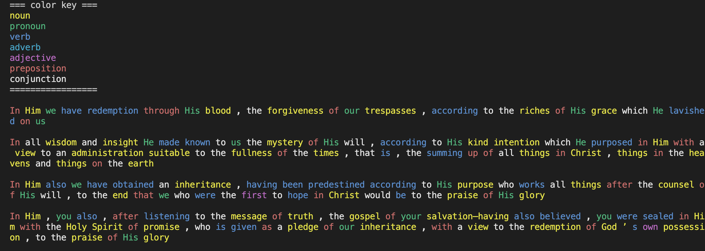

This repo uses the NLTK library to identity parts of speech in the a text file.



To run:
```shell
python -m venv .venv
source .venv/bin/activate
python -m pip install -r requirements.txt # install nltk
python -m spacy download en_core_web_sm # download spacy model
python -m main eph_1_7-14.txt
```

Optionally, you can use a bigger model from spacy (it is ~400mb):

```shell
python -m spacy download en_core_web_lg
python -m main eph_1_7-14.txt --lg
```
